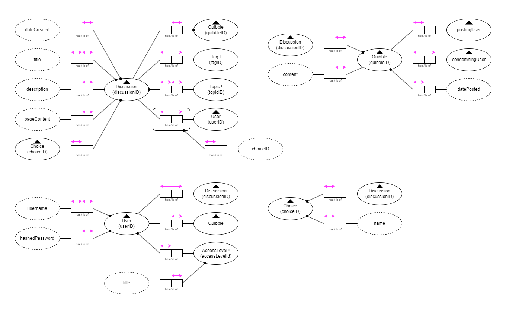
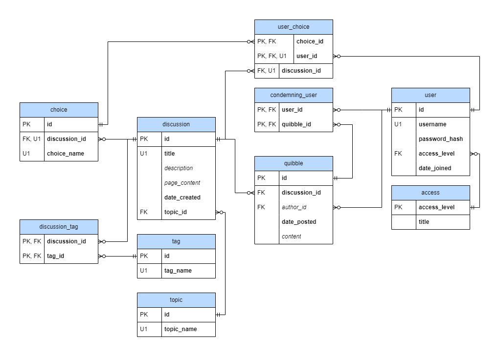

# FribbleQuibble Backend
Backend repository for the FribbleQuibble discussion website.

### Responsibilities
The backend is responsible for the following components for website functionality:

- Database for data storage
- API for database access
- Reverse proxy for handling API access, rate limiting, and HTTPS security

### Dependencies/Tech Stack
The backend responsibilities are implemented using a variety of technologies.

- [MariaDB](https://mariadb.org/) for DBMS
- [Express.js](https://expressjs.com/) for API framework
- [NGINX](https://www.nginx.com/) for reverse proxy and rate limiting
- [Certbot](https://certbot.eff.org/)+NGINX for HTTPS security
- [Docker Compose](https://docs.docker.com/compose/) for deployment

### Database Structure

Conceptual Model:

Logical Model:

The physical model can be found [here](https://github.com/Ringman3640/fribblequibble-backend/blob/main/mariadb/fribblequibble_db.sql).

### Deployment
Deploying the backend requires ENV files that are not provided within this repository. Without these files, the backend server will fail to start. Search for template environment files (with the `.env.template` file type), populate any variables marked 'CONFIDENTIAL', and remove the `.template` postfix from their filename.

A development instance can be deployed by running the following command in the local repository folder:

`docker compose -f docker-compose-dev.yaml up -d`

Instructions for deploying a production instance on a VPS can be found [here](./deploy/deploy-instructions.md).
